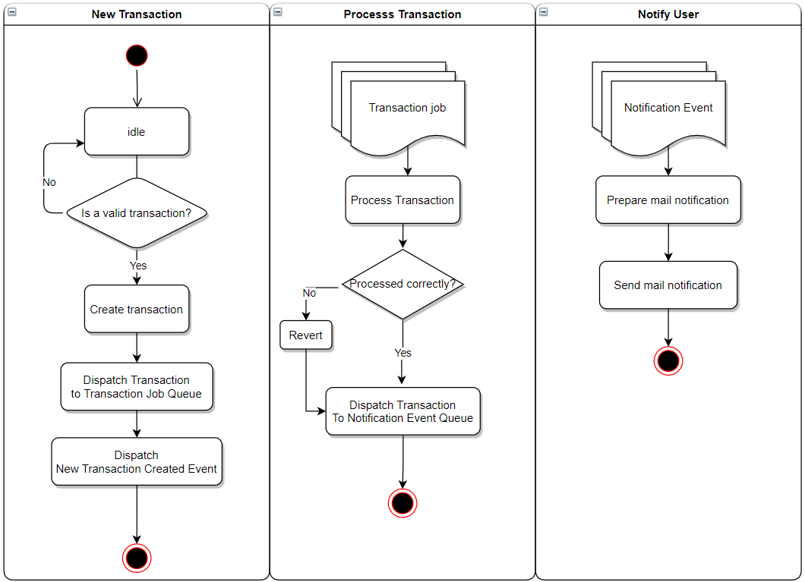
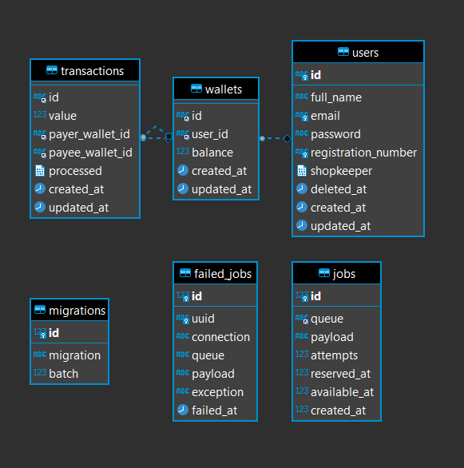

# <p align="center">Simple Money Transfer API 💲</p>

<p align="center">
    
    
    
    
</p>

## 💬 About

This is a simple API to transfer money between users.

## :triangular_ruler: Architecture

This system uses an Event Driven Architecture with `events`, `jobs` & `queues`.



### Structure

This app uses the **Service Repository Pattern** to improve the maintainability of the code.
All bussines logic is placed in the `services` folder.

```sh
.
├── database
│   ├── factories
│   ├── seeders
│   └── migrations
├── tests
│   ├── Integration
│   └── Unit
├── app
│   ├── Services
│   ├── Listeners
│   ├── Providers
│   ├── Console
│   ├── Mail
│   ├── Events
│   ├── Exceptions
│   ├── Helpers
│   ├── Http
│   ├── Models
│   ├── Repositories
│   ├── Observers
│   └── Jobs
└── public
```

### Database



## :computer: Technologies

-   [Lumen 8](https://lumen.laravel.com/)
-   [PHP 8](https://www.php.net/)
-   [MySQL 8](https://www.mysql.com/)
-   [Nginx](https://www.nginx.com/)
-   [PHP_CodeSniffer](https://github.com/squizlabs/PHP_CodeSniffer)
-   [PHPStan](https://github.com/phpstan/phpstan)
-   [PHPUnit](https://phpunit.de/)
-   [PHPMD](https://phpmd.org/)
-   [Docker](https://www.docker.com/)

## :scroll: Requirements

-   [Docker](https://www.docker.com/)
-   [Docker Compose](https://docs.docker.com/compose/)

## :cd: Installation

```sh
git clone git@github.com:filipe1309/t-simple-money-transfer-api.git
```

```sh
cd t-simple-money-transfer-api
```

## :runner: Running

```sh
docker-compose up -d
```

```sh
docker-compose exec php php artisan queue:listen --queue=transactionJobQueue,notificationEventQueue --timeout=60 --sleep=3 --tries=3
```

> Access http://localhost:5001

### Trigger transaction

`POST http://localhost:5001/v1/transactions`

```json
{
    "payer": "91e92c5f-d9d0-437a-9435-58839fdbb6c5",
    "payee": "9442fd46-44cf-4571-9bfd-59670b765719",
    "value": 444
}
```

> `payer` & `payee` are the wallets id of the users

### List all users

`GET http://localhost:5001/v1/users`

### List one users

`GET http://localhost:5001/v1/users/USER-ID`

> Where `USER-ID` is the id of the user =)

## :white_check_mark: Tests

> Tests suite with PHPUnit, PHP_CodeSniffer, PHPStan & PHPMD.

```sh
./bin/tests.sh
```

## :pushpin: Roadmap

-   [ ] Add authentication and authentication with JWT
-   [ ] Use a Supervisor to monitor the queues and keep works active
-   [ ] Improve code organization with Clean Architectures
-   [ ] Improve authentication with Laravel Passport
-   [ ] Refactor Transaction & Notification systems into isolated microservices
-   [ ] Migrate to to Cloud, like AWS, to be able to scale and use things like SQS, Lambdas & SNS.

## License

[MIT](https://choosealicense.com/licenses/mit/)

## About Me

<p align="center">
    <a style="font-weight: bold" href="https://www.linkedin.com/in/filipe1309/">
    
    </a>
</p>

---

<p align="center">
    Done with ♥ by <a style="font-weight: bold" href="https://www.linkedin.com/in/filipe1309/">Filipe Leuch Bonfim</a> 🖖
</p>

---

> @ Generated with [skeleton-courses](https://github.com/filipe1309/skeleton-courses)
